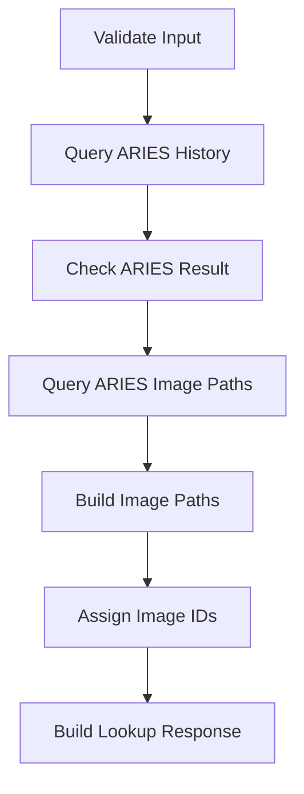
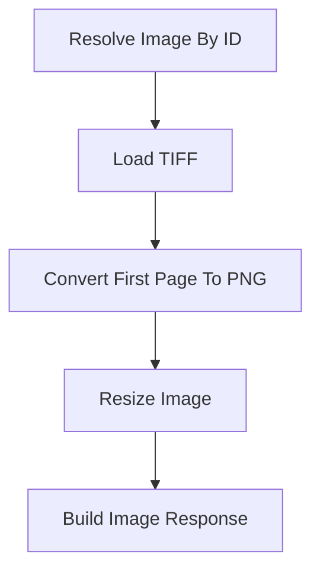

# Design Doc: Manufacturing CSAM Image Lookup Web App

> Please DON'T remove notes for AI

## Requirements

> Notes for AI: Keep it simple and clear.
> If the requirements are abstract, write concrete user stories

Build a FastAPI web app with a Jinja2-based frontend that allows a user to enter a manufacturing Visual ID (VID), validate that VID against manufacturing history, resolve candidate CSAM image directories through PyUber queries, search those directories for matching image files, and display all valid CSAM images inline in the browser.

User stories:

1. As a user, I can enter a VID on the main page and submit a lookup request.
2. As a user, I can see status updates while the backend validates the VID, resolves candidate directories, and finds matching images.
3. As a user, I can view all valid matched CSAM images inline after lookup.
4. As a user, I receive clear error messages when the VID is missing, the VID is not found at operations 3040/3041, no candidate directory exists, or no matching image files are found.
5. As an API consumer, I can call the lookup endpoint to receive structured manufacturing metadata plus a list of matching images.
6. As an API consumer, I can request an individual image through a unique image delivery endpoint.
7. As an operator, I can inspect all endpoint request and response shapes through Swagger UI.

Frameworks and technologies:

1. Backend: FastAPI
2. Frontend: HTML, JavaScript, Jinja2 templates
3. Database access: PyUber
4. Filesystem access: Python standard library with UNC path support
5. Image delivery: Python standard library, with optional image-processing library only if browser compatibility later requires conversion

Proof-of-concept rules decided so far:

1. VID validation is query-based, not format-based.
2. The app will run the initial ARIES ULT_Data query constrained to operations 3040 and 3041.
3. If no ARIES record is returned, the app stops and returns: VID was not found. It either does not exist or was not run at operations 3040/3041. Please check again.
4. The app will use an ARIES-only query model: VID history from A_Ube_Unit_Hist2, then image paths from A_OBJ_* session tables.
5. If the ARIES query returns multiple rows, the app will preserve all rows and process them downstream.
6. The app will preserve all candidate manufacturing rows returned by the MARS stage.
7. The app will validate all candidate directories on the filesystem rather than assuming only one valid folder.
8. Candidate directories will be deduplicated before filesystem checks.
9. A file is a valid image candidate only if its filename contains both the VID exactly as submitted and the exact case-sensitive keyword HBI.
10. Only files with the exact .tiff extension are valid image candidates.
11. If multiple files match, all matching files are valid and must be returned.
12. Matched images will be deduplicated by absolute file path before the final response is built.
13. Because one VID can resolve to many images, image delivery will use image_id rather than VID.
14. For proof of concept, the application will maintain an in-memory mapping from image_id to resolved image metadata and source file path with a 30-minute TTL.
15. Matched TIFF files will be converted to PNG for inline browser display.
16. Only the first page of each TIFF will be used.
17. Converted images will be resized proportionally to fit within a maximum width of 1600 pixels and a maximum height of 1200 pixels, without upscaling.
18. If one matched image cannot be loaded or converted, that image will be marked with an error while other valid matched images continue to display.
19. The lookup response will include per-image status and message fields.

## Flow Designs

> Notes for AI:
> 1. Create a subsection for each flow needed by analyzing the user request.
> 2. For each subsection, list the nodes that are used and their reasons. Then, create a mermaid flowchart depicting how the nodes are connected in a flow
> 3. For each subsection, also detail the shared store design that is passed between nodes in the flow. Minimize redundancy as much as possible for the shared store.
> 4. DO NOT create any flows that consist of just one node. That is unnecessary. If the app does not require any flows, do not list this section.

### Lookup Flow:
1. **Validate Input Node**: Ensures the VID input is present before any external work begins.
2. **Query ARIES History Node**: Uses PyUber to run the ULT_Data lookup for the submitted VID under operations 3040 and 3041.
3. **Check ARIES Result Node**: Stops the flow with a user-facing not-found message if ARIES returns no result.
4. **Query ARIES Image Paths Node**: Uses PyUber to query A_OBJ_SESSION, A_OBJ_MEDIA_TESTING, A_OBJ_UNIT_TESTING, and A_OBJ_UNIT_DATA for image file paths linked to the lots and VIDs from the ARIES history query.
5. **Build Image Paths Node**: Constructs UNC image file paths from the query results and validates that each file exists on the filesystem.
6. **Assign Image IDs Node**: Assigns a backend-generated image_id to each matched image result and stores the mapping in in-memory state.
7. **Build Lookup Response Node**: Produces the final lookup response payload for the API and frontend.



The shared store structure is organized as follows:

```python
shared = {
   "request": {
      "vid": "",
      "image_id": None,
   },
   "validation": {
      "input_present": False,
      "errors": [],
   },
   "manufacturing": {
      "aries_results": [],
      "image_path_results": [],
   },
   "filesystem": {
      "matched_images": [],
   },
   "response": {
      "lookup_result": None,
      "error": None,
   },
}
```

Notes on shared-store content:

1. manufacturing.aries_results stores all validated ARIES lookup rows.
2. manufacturing.image_path_results stores all rows from the A_OBJ_* image path query.
3. filesystem.matched_images stores all valid matched image records, where each item includes image_id, file_name, absolute_path, source_directory, image_url, status, and message.

### Image Delivery Flow:
1. **Resolve Image By ID Node**: Finds the matched image record for the requested image_id from the in-memory mapping.
2. **Load TIFF Node**: Loads the TIFF bytes from the resolved UNC path.
3. **Convert First Page To PNG Node**: Converts only the first TIFF page into PNG format for browser display.
4. **Resize Image Node**: Resizes the converted PNG proportionally to fit within 1600x1200 without upscaling.
5. **Build Image Response Node**: Returns the binary PNG response to the client with the appropriate MIME type.



The shared store structure is organized as follows:

```python
shared = {
   "request": {
      "image_id": "",
   },
   "filesystem": {
      "resolved_image": None,
   },
   "image": {
      "binary_content": None,
      "mime_type": None,
   },
   "response": {
      "error": None,
   },
}
```

Why these flows are structured this way:

1. The ARIES VID history and image path queries represent separate dependency stages and should remain separate nodes.
2. Image path validation should not be mixed into database lookup.
3. Image discovery should return all valid matches, not prematurely reduce to one image.
4. Image delivery should operate on a unique backend-generated identifier rather than re-running the entire VID lookup for every image fetch.

## Nodes
> Notes for AI: Determine all the nodes needed and the specifications of the nodes based on the user request
1. Validate Input Node
  - *Purpose*: Ensure the request contains a VID.
  - *Type*: Regular
  - *Steps*:
   - *prep*: Read request.vid
   - *exec*: Check whether the VID is present and non-empty
   - *post*: Write validation state or a missing-input error

2. Query ARIES History Node
  - *Purpose*: Validate the VID against manufacturing history under operations 3040 and 3041 and retrieve the initial lot and operation metadata.
  - *Type*: Regular
  - *Steps*:
   - *prep*: Read request.vid
   - *exec*: Run the ARIES ULT_Data query through PyUber
   - *post*: Write returned ARIES rows into manufacturing.aries_results

3. Check ARIES Result Node
  - *Purpose*: Stop the flow if the VID is not found under the required ARIES constraint.
  - *Type*: Regular
  - *Steps*:
   - *prep*: Read manufacturing.aries_results
   - *exec*: Check whether at least one valid ARIES result exists
   - *post*: Either continue or write the user-facing not-found message into response.error

4. Query ARIES Image Paths Node
  - *Purpose*: Resolve image file paths from ARIES A_OBJ_* session tables using lots and VIDs from the history query.
  - *Type*: Regular
  - *Steps*:
   - *prep*: Read manufacturing.aries_results
   - *exec*: Run the A_OBJ_SESSION / A_OBJ_MEDIA_TESTING / A_OBJ_UNIT_TESTING / A_OBJ_UNIT_DATA query through PyUber for FCM module with IMAGE_NAME parameter
   - *post*: Write returned rows to manufacturing.image_path_results; if empty, write error

5. Build Image Paths Node
  - *Purpose*: Construct UNC image file paths from query results and validate that each file exists.
  - *Type*: Regular
  - *Steps*:
   - *prep*: Read manufacturing.image_path_results
   - *exec*: Build UNC paths as \\server\relative_path\filename and check os.path.isfile for each
   - *post*: Write valid image records to filesystem.matched_images; if empty, write error

6. Assign Image IDs Node
  - *Purpose*: Generate unique backend image identifiers for each matched image and store them in short-lived in-memory state.
  - *Type*: Regular
  - *Steps*:
   - *prep*: Read filesystem.matched_images
   - *exec*: Generate image_id values, image_url values, and TTL-backed in-memory mapping entries for each image
   - *post*: Write the enriched image records back to filesystem.matched_images

7. Build Lookup Response Node
  - *Purpose*: Build the final response payload for the lookup endpoint and frontend.
  - *Type*: Regular
  - *Steps*:
   - *prep*: Read request, manufacturing, filesystem, and response state
   - *exec*: Build the structured lookup payload
   - *post*: Write response.lookup_result

8. Resolve Image By ID Node
  - *Purpose*: Resolve one matched image from the backend-generated image_id.
  - *Type*: Regular
  - *Steps*:
   - *prep*: Read request.image_id
   - *exec*: Resolve the matching image record from the in-memory mapping and verify it has not expired
   - *post*: Write the resolved image record to filesystem.resolved_image

9. Load TIFF Node
  - *Purpose*: Read the resolved TIFF file from disk or network share.
  - *Type*: Regular
  - *Steps*:
   - *prep*: Read filesystem.resolved_image.absolute_path
   - *exec*: Load the file bytes
   - *post*: Write raw image content into the image section of the shared store

10. Convert First Page To PNG Node
  - *Purpose*: Convert the first TIFF page into PNG format for browser display.
  - *Type*: Regular
  - *Steps*:
   - *prep*: Read the loaded TIFF content
   - *exec*: Convert the first page to PNG
   - *post*: Write PNG data to the image section of the shared store

11. Resize Image Node
  - *Purpose*: Resize the PNG image proportionally for browser-friendly display without upscaling.
  - *Type*: Regular
  - *Steps*:
   - *prep*: Read converted PNG data
   - *exec*: Resize to fit within 1600x1200 while preserving aspect ratio and avoiding upscaling
   - *post*: Write final PNG bytes and MIME type

12. Build Image Response Node
  - *Purpose*: Prepare the HTTP response for a single image request.
  - *Type*: Regular
  - *Steps*:
   - *prep*: Read image.binary_content and image.mime_type
   - *exec*: Package the final image response payload
   - *post*: Write response output for the route handler


## Utility Functions
> Notes for AI:
> 1. Understand the utility function needed by thoroughly considering the user request
> 2. Include only the necessary utility functions, based on nodes in the flows.

1. **PyUber Client Utility** (`utils/pyuber_client.py`)
   - *Input*: query text and connection configuration
   - *Output*: normalized query result rows
   - Used by the ARIES and MARS query utilities

2. **ARIES VID Lookup Utility** (`utils/db_aries.py`)
   - *Input*: VID
   - *Output*: one or more rows containing visual_id, lot_1, and operation_1
   - Used by the Query ARIES History Node

3. **ARIES Image Path Lookup Utility** (`utils/db_aries.py`)
   - *Input*: ARIES result rows (lots and VIDs)
   - *Output*: rows containing lot, operation, visual_id, image_filer_address, image_relative_path, and parameter_value (image filename)
   - Used by the Query ARIES Image Paths Node

4. **Image Path Builder Utility** (`utils/path_builder.py`)
   - *Input*: ARIES image path query results
   - *Output*: validated image file records with constructed UNC paths
   - Used by the Build Image Paths Node

5. **Image ID Utility** (`utils/image_identity.py`)
   - *Input*: matched image records
   - *Output*: image_id, image_url, and TTL-backed mapping entries
   - Used by the Assign Image IDs Node

6. **TIFF Loader Utility** (`utils/image_loader.py`)
   - *Input*: absolute TIFF file path
   - *Output*: TIFF content
   - Used by the Load TIFF Node

7. **TIFF To PNG Conversion Utility** (`utils/image_convert.py`)
   - *Input*: TIFF content
   - *Output*: first-page PNG content
   - Used by the Convert First Page To PNG Node

8. **Image Resize Utility** (`utils/image_resize.py`)
   - *Input*: PNG content and max dimensions
   - *Output*: resized PNG content and MIME type
   - Used by the Resize Image Node

9. **Response Builder Utility** (`utils/responses.py`)
   - *Input*: lookup or image data from the shared store
   - *Output*: structured API response payloads
   - Used by the Build Lookup Response Node and Build Image Response Node


## Routes
> Notes for AI:
> For each route needed, list the route and its description
1. `"/"` where the UI sits
   - Renders the main page with a VID input, lookup button, status area, error area, and inline image display area for all matched images

2. `"/docs"` where the Swagger UI sits
   - Exposes FastAPI-generated OpenAPI documentation for all endpoints

3. `"/health"` where the user can get a health update on the app
   - Returns a lightweight health payload indicating service availability

4. `"/lookup"` where the user or frontend requests lookup metadata
   - Accepts a VID
   - Runs the Lookup Flow
   - Returns manufacturing metadata, validated directories, and all matching image metadata

5. `"/image/{image_id}"` where an individual image is returned
   - Accepts an image_id
   - Runs the Image Delivery Flow
   - Returns the corresponding PNG bytes for inline display

Recommended lookup response shape:

```json
{
   "vid": "D609A810",
   "status": "success",
   "message": "2 matching image files found.",
   "manufacturing": {
      "aries_results": [
         {
            "visual_id": "D609A810",
            "lot_1": "D609A810",
            "operation_1": "3040"
         }
      ]
   },
   "directories": [
      {
         "directory": "\\\\atdfile1\\dfM_IMAGE\\WW10_2026\\3040\\CSM020\\D609A810\\",
         "exists": true
      }
   ],
   "images": [
      {
         "image_id": "img_001",
         "file_name": "D609A810_HBI_view1.tiff",
         "image_url": "/image/img_001",
         "source_directory": "\\\\atdfile1\\dfM_IMAGE\\WW10_2026\\3040\\CSM020\\D609A810\\",
         "status": "ready",
         "message": "Image is available for display."
      },
      {
         "image_id": "img_002",
         "file_name": "D609A810_HBI_view2.tiff",
         "image_url": "/image/img_002",
         "source_directory": "\\\\atdfile1\\dfM_IMAGE\\WW10_2026\\3040\\CSM020\\D609A810\\",
         "status": "ready",
         "message": "Image is available for display."
      }
   ]
}
```

Recommended error behavior:

1. Missing VID:
   - Return 400 Bad Request with a validation error explaining that VID input is required.
2. ARIES not found at 3040:
   - Return 404 Not Found with: VID was not found. It either does not exist or was not run at operation 3040. Please check again.
3. ARIES succeeded but MARS returned no candidate metadata:
   - Return 404 Not Found with a metadata-resolution error.
4. Candidate metadata exists but no valid directory exists or is accessible:
   - Return 404 Not Found with a directory-resolution error.
5. Valid directories exist but no matching .tiff files containing case-sensitive VID and HBI are found:
   - Return 404 Not Found with an image-discovery error.
6. Image ID not found or expired:
   - Return 404 Not Found with an error explaining that the image reference expired or was not found.
7. Database connectivity or PyUber execution failure:
   - Return 503 Service Unavailable.
8. UNC share access failure or transient file-access infrastructure failure:
   - Return 503 Service Unavailable.
9. TIFF conversion failure for one specific image:
   - Return 422 Unprocessable Entity for that image request while keeping the overall lookup response successful.

