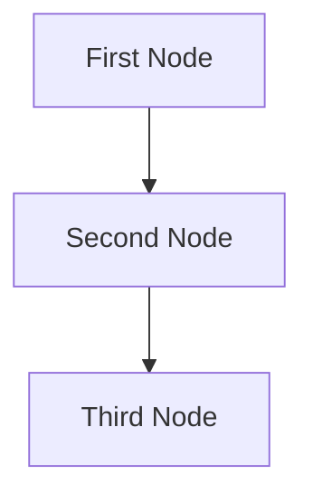

# Design Doc: Your Project Name

> Please DON'T remove notes for AI

## Requirements

> Notes for AI: Keep it simple and clear.
> If the requirements are abstract, write concrete user stories
> Include the frontend and backend framework being used. If not specified, default is FastAPI for backend and frontend (use HTML and Jinja2 templates)


## Flow Designs

> Notes for AI:
> 1. Create a subsection for each flow needed by analyzing the user request. 
> 2. For each subsection, list the nodes that are used and their reasons. Then, create a mermaid flowchart depicting how the nodes are connected in a flow
> 3. For each subsection, also detail the shared store design that is passed between nodes in the flow. Minimize redundancy as much as possible for the shared store.
> 4. DO NOT create any flows that consist of just one node. That is unnecessary. If the app does not require any flows, do not list this section.


### Your Flow Name 1:
1. **First Node**: This node is for ...
2. **Second Node**: This node is for ...
3. **Third Node**: This node is for ...



The shared store structure is organized as follows:

```python
shared = {
    "key": "value"
}
```

### Your Flow Name 2:
...


## Nodes
> Notes for AI: Determine all the nodes needed and the specifications of the nodes based on the user request
1. First Node
  - *Purpose*: Provide a short explanation of the node’s function
  - *Type*: Decide between Regular, Batch, or Async
  - *Steps*:
    - *prep*: Read "key" from the shared store
    - *exec*: Call the utility function
    - *post*: Write "key" to the shared store

2. Second Node
  ...


## Utility Functions
> Notes for AI:
> 1. Understand the utility function needed by thoroughly considering the user request
> 2. Include only the necessary utility functions, based on nodes in the flows.

1. **Call LLM** (`utils/call_llm.py`)
   - *Input*: prompt (str)
   - *Output*: response (str)
   - Generally used by most nodes for LLM tasks

2. **Embedding** (`utils/get_embedding.py`)
   - *Input*: str
   - *Output*: a vector of 3072 floats
   - Used by the second node to embed text


## Routes
> Notes for AI:
> For each route needed, list the route and its description
1. `"/"` where the UI sits
2. `"/docs"` where the Swagger UI sits  
3. `"/health"` where the user can get a health update on the app